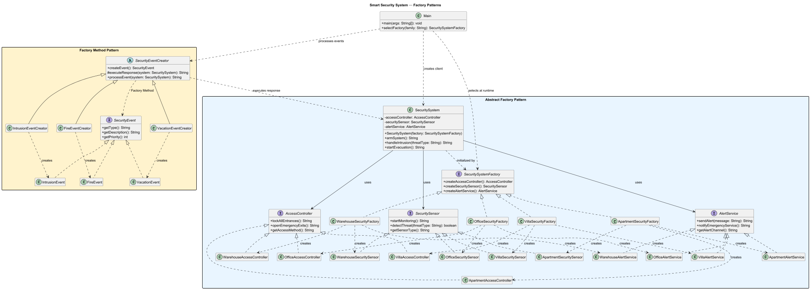

# Smart Security System

## Assignment

Software Design Patterns — Assignment 2  
Patterns: Factory Method and Abstract Factory

## Project Overview

This project represents a smart security ecosystem for different building types.

The system supports four product families:

- Apartment
- Villa
- Office
- Warehouse

Each family contains three compatible product types:

1. Access controller
2. Security sensor
3. Alert service

## Initial Design Problems

The first version was implemented without factories. The `Main` class created all objects directly with `new` and used a large `if/else` structure.

The initial design had several problems:

1. `Main` depended on every concrete product class.
2. Business operations were duplicated for every building type.
3. Adding a new family required changing a large part of `Main`.
4. Products from different families could be mixed accidentally.
5. Object creation and business logic were located in the same class.

The initial version is preserved in the first Git commit.

## Abstract Factory

`SecuritySystemFactory` is the Abstract Factory interface.

It creates three related product types:

- `AccessController`
- `SecuritySensor`
- `AlertService`

Concrete factories:

- `ApartmentSecurityFactory`
- `VillaSecurityFactory`
- `OfficeSecurityFactory`
- `WarehouseSecurityFactory`

Each concrete factory creates a complete and compatible family of security products.

The `SecuritySystem` client receives only a `SecuritySystemFactory`. It does not receive separate concrete products. This architectural decision prevents the client from mixing products from different families.

## Factory Method

`SecurityEvent` is the product interface.

Concrete products:

- `IntrusionEvent`
- `FireEvent`
- `VacationEvent`

`SecurityEventCreator` is the abstract Creator. Its `createEvent()` method is the Factory Method.

Concrete creators:

- `IntrusionEventCreator`
- `FireEventCreator`
- `VacationEventCreator`

The Creator also contains useful business logic. It validates input, creates an event, determines its priority, creates an event report and executes the required security response.

## Business Operations

The system contains three operations that use several products together:

1. Arm the security system.
2. Handle an intrusion.
3. Start an emergency evacuation.

## Runtime Selection

The product family is selected using a command-line argument.

Available values:

```text
apartment
villa
office
warehouse
```

If no argument is provided, the system uses `apartment`.

Example:

```bash
java Main warehouse
```

After initialization, all business logic works through interfaces and abstract types.

## Fourth Product Family

The fourth family, `Warehouse`, was added after the original architecture.

Added files:

- `WarehouseAccessController.java`
- `WarehouseSecuritySensor.java`
- `WarehouseAlertService.java`
- `WarehouseSecurityFactory.java`

Modified existing file:

- `Main.java` — one new `warehouse` case was added to runtime factory selection.

The existing `SecuritySystem`, interfaces, event products, event creators and original factories were not changed.

## Automated Tests

The project contains 22 JUnit tests.

The tests verify:

- all original product families;
- the Warehouse family;
- creation of concrete products;
- product-family compatibility;
- runtime factory selection;
- three business operations;
- Factory Method products and creators;
- client operation through abstractions;
- invalid family names;
- blank input;
- null factory and null system cases.

## UML Diagram



The diagram contains marked regions for Abstract Factory and Factory Method.

## Running the Project

1. Open the project in IntelliJ IDEA.
2. Load Maven dependencies.
3. Open the run configuration for `Main`.
4. Add a product family to `Program arguments`.
5. Run the application.

To run the automated tests, right-click `src/test/java` and select `Run All Tests`.

Using Maven:

```bash
mvn clean test
```

## Technologies

- Java 25
- Maven
- JUnit 5
- PlantUML
- Git and GitHub

## Repository

https://github.com/Vinchester021/assignment-2-factories